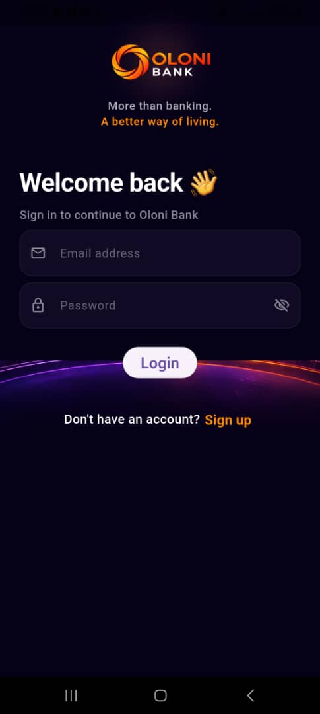
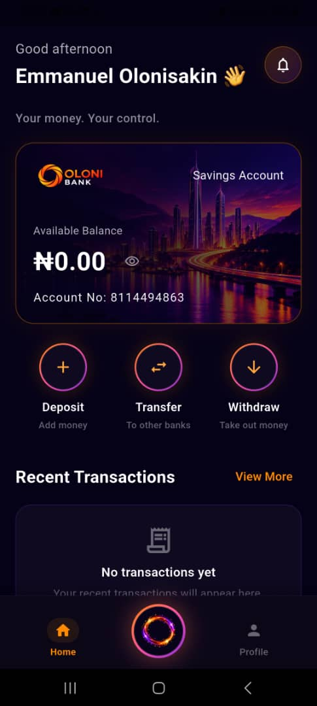
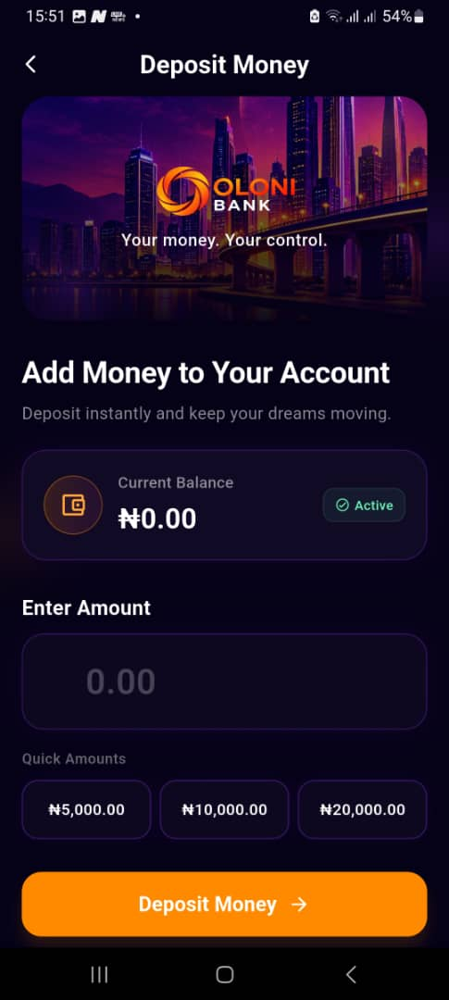
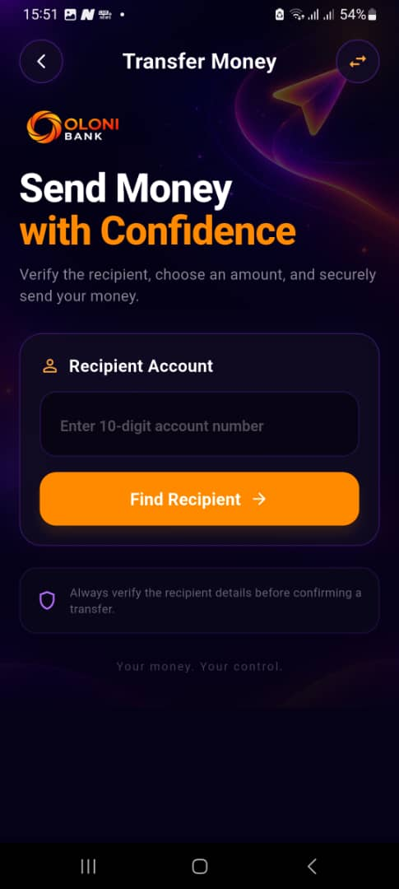

# 🏦 Oloni Bank

````
### A Full-Stack Digital Banking Application Built with Flutter, FastAPI & PostgreSQL

Oloni Bank is a fictional digital banking application I built as a practical full-stack software project.

The project was created to help me understand how the different components of a modern banking application work together, from the mobile interface and backend APIs to authentication, database operations and deployment.

I built the Flutter mobile application, developed the backend with Python and FastAPI, connected the system to PostgreSQL and deployed the backend API to a production hosting environment.

> **The result is a functional Android application connected to a real backend and PostgreSQL database.**

---

## 📱 Try Oloni Bank

Oloni Bank 1.0 is available as an Android APK.

You can install the application on an Android device and experience the working banking application firsthand.

### 🚀 [Download Oloni Bank v1.0.0](https://github.com/Olonisakin-Emmanuel/oloni-bank-flutter/releases/latest)

> **Important:** Oloni Bank is a fictional banking application created for educational, demonstration and portfolio purposes. It uses demo/test funds and should not be used for real financial transactions.

---

## 📌 Project Overview

Oloni Bank demonstrates the architecture and core functionality behind a modern digital banking application.

Users can:

- Create an account
- Log in securely
- View account information and balance
- Deposit funds
- Withdraw funds
- Transfer funds between Oloni Bank accounts
- View transaction history
- View individual transaction details
- Manage their profile

One of the main goals of this project was not simply to build a banking interface, but to understand what happens behind the interface.

The project helped me understand how:

```text
Flutter → REST API → Backend Logic → Database
````

work together as one complete system.

The backend API is deployed on Render and uses PostgreSQL as the production database.

---

## ⚠️ Disclaimer

### Fictional Banking Application

Oloni Bank is a fictional banking application created strictly for **educational, demonstration and portfolio purposes**.

It is **not a real financial institution**, is not affiliated with any bank or financial institution and is not intended for real financial transactions.

The application uses test/demo funds to demonstrate banking workflows and software engineering concepts.

---

## ✨ Key Features

### 🔐 User Authentication

* Account registration
* Secure login
* JWT-based authentication
* Password hashing with Argon2
* Protected authenticated endpoints

### 💰 Account Management

* Customer account creation
* Account information
* Account balance
* Customer and account data stored in PostgreSQL

### 💵 Deposits

* Deposit funds into an Oloni Bank account
* Backend validation and processing
* Real-time balance updates

### 💸 Withdrawals

* Withdraw funds from an account
* PIN verification
* Available balance validation
* Transaction recording

### 🔄 Account Transfers

* Transfer funds between Oloni Bank accounts
* Recipient account lookup
* PIN verification
* Backend transaction processing
* Transaction records stored in PostgreSQL

### 📜 Transaction History

* View previous transactions
* View transaction details
* Transaction data retrieved from the backend API

### 👤 Profile

* View customer information
* Display registered name, email and phone number

### 📱 Android Mobile Application

* Built with Flutter and Dart
* Responsive mobile interface
* Dark-themed modern UI
* Tested on a physical Android device
* Connected to the deployed backend API

### 🌐 Backend Deployment

* FastAPI backend deployed on Render
* PostgreSQL production database
* SQLAlchemy database integration
* Environment-based configuration

---

## 💡 What Makes This Project Different

Oloni Bank was built to go beyond a visual banking prototype.

Rather than creating only a collection of mobile screens, I implemented the complete flow between the mobile application, backend API and database.

For example, when a user performs a transaction:

```text
User
 ↓
Flutter Mobile Application
 ↓
FastAPI REST API
 ↓
Authentication & Validation
 ↓
SQLAlchemy
 ↓
PostgreSQL
 ↓
Updated Data
 ↓
Flutter Application
```

This allowed me to gain practical experience understanding how different parts of a real software system communicate and work together.

---

## 🏗️ System Architecture

Oloni Bank uses a full-stack architecture built with Flutter, FastAPI, SQLAlchemy and PostgreSQL.

```
Flutter App
     ↓
FastAPI Backend
     ↓
SQLAlchemy
     ↓
PostgreSQL

```

The Flutter application communicates with the FastAPI backend through REST APIs.

The backend handles authentication, validation and banking operations, while SQLAlchemy is used to communicate with PostgreSQL.

---

## 🔄 How the Application Works

The main application flow is:

1. A user creates an account through the Flutter mobile application.
2. The Flutter application sends the account information to the FastAPI backend.
3. The backend validates the request.
4. Customer and account information is stored in PostgreSQL.
5. The user logs in through the mobile application.
6. The backend authenticates the user and returns a JWT token.
7. The Flutter application securely stores the authentication token.
8. Authenticated users can perform banking operations such as deposits, withdrawals and transfers.
9. The backend validates and processes each transaction.
10. Transaction information is stored in PostgreSQL.
11. The Flutter application retrieves updated information from the API and displays it to the user.

Building this flow helped me understand the relationship between a mobile frontend, backend services, APIs, authentication and persistent database storage.

---

## 📱 Application Screenshots

### Splash Screen


### Login Screen



### Dashboard



### Deposit



### Transfer



### Transaction Details


---

## 🚀 Deployment

The FastAPI backend for Oloni Bank is deployed on Render.

**Production API:**

[https://oloni-bank-api.onrender.com](https://oloni-bank-api.onrender.com)

The deployed backend uses:

* FastAPI
* PostgreSQL
* SQLAlchemy
* JWT authentication
* Environment variables for configuration
* Render for hosting

The Flutter application is configured to communicate with the deployed API.

> Although the backend is deployed and the Android application communicates with it remotely, Oloni Bank is still a fictional portfolio application and is not a real banking service.

---

## 📦 Android Application

Oloni Bank 1.0 has been packaged as an Android APK and tested successfully on a physical Android device.

**Version:** `1.0.0`

### Download

**[Download Oloni Bank v1.0.0](https://github.com/Olonisakin-Emmanuel/oloni-bank-flutter/releases/latest)**

The APK can be installed on an Android device for demonstration and testing.

---

## 🛠️ Technology Stack

### Frontend

* Flutter
* Dart

### Backend

* Python
* FastAPI
* SQLAlchemy
* JWT Authentication
* Argon2 Password Hashing

### Database

* PostgreSQL

### Deployment

* Render

### Development Tools

* Git
* GitHub
* Visual Studio Code
* Android Studio

---

## 📂 Project Structure

```text
oloni_bank/
│
├── android/
├── ios/
├── lib/
│   ├── config/
│   ├── screens/
│   ├── services/
│   └── ...
│
├── assets/
│   └── Images/
│
├── screenshots/
│   ├── Dashboard.jpeg
│   ├── Deposit_screen.jpeg
│   ├── Login_screen.jpeg
│   ├── Splash_screen.jpeg
│   ├── Transaction Details.jpeg
│   └── Transfer.jpeg
│
├── test/
├── pubspec.yaml
└── README.md
```

---

## 💻 Running the Project Locally

### 1. Clone the Flutter repository

```bash
git clone https://github.com/Olonisakin-Emmanuel/oloni-bank-flutter.git
cd oloni-bank-flutter
```

### 2. Install Flutter dependencies

```bash
flutter pub get
```

### 3. Configure the API

The Flutter application uses a central API configuration to communicate with the FastAPI backend.

For local development, configure the application to point to your local FastAPI server.

For the deployed environment, the application uses:

```text
https://oloni-bank-api.onrender.com
```

### 4. Run the application

```bash
flutter run
```

---

## 🔧 Backend Repository

The FastAPI backend is maintained in a separate repository.

**Backend Repository:**

[https://github.com/Olonisakin-Emmanuel/oloni-bank-api](https://github.com/Olonisakin-Emmanuel/oloni-bank-api)

The backend repository contains:

* API endpoints
* Authentication logic
* Banking operations
* Database models
* SQLAlchemy integration
* PostgreSQL configuration

---

## 📚 What I Learned

Building Oloni Bank gave me practical experience working across multiple layers of a software system.

### Mobile Development

* Building mobile interfaces with Flutter
* Working with Dart
* Managing screens and navigation
* Connecting Flutter applications to REST APIs
* Handling loading, success and error states

### Backend Development

* Building REST APIs with Python and FastAPI
* Designing API endpoints
* Request validation
* Authentication and authorization
* Processing banking operations

### Database Development

* Working with PostgreSQL
* Designing database models
* Using SQLAlchemy as an ORM
* Persisting customer, account and transaction data

### Security

* JWT authentication
* Password hashing with Argon2
* Authentication-protected API endpoints
* Secure token storage on the mobile application

### Deployment

* Deploying a FastAPI backend
* Connecting a deployed API to PostgreSQL
* Managing environment configuration
* Connecting a mobile application to a remote backend

### Software Development

* Git and GitHub
* Debugging
* Testing edge cases
* Handling network failures
* Understanding frontend/backend communication
* Working across multiple components of a software system

The most important lesson from this project was that building a working application involves much more than writing code.

It requires understanding how the different components communicate, testing failure scenarios, debugging issues and making sure the entire system works together.

---

## 🧠 Why I Built Oloni Bank

My interest in technology has grown from wanting to understand how technology can be used to solve real-world problems, particularly within financial services.

My experience in banking exposed me to different customer and operational challenges.

Rather than only learning technology theoretically, I wanted to challenge myself to build a complete product.

Oloni Bank became an opportunity to take what I had learned about Python, backend development, databases and mobile development and bring those skills together into one working application.

The project represents an important step in my journey toward building **AI-powered and technology-driven financial products**.

---

## 🔮 Future Development — Oloni Bank 2.0

Oloni Bank 1.0 focuses on establishing the core digital banking foundation.

Future versions may explore more intelligent and personalised financial features, including:

* 🎙️ **Voice Banking** — allowing users to interact with the application using voice.
* 🤖 **Oloni AI** — an AI-powered financial assistant.
* 📊 **Oloni Insight** — personalised financial insights and analytics.
* 🎯 **Financial Goals** — tools for setting and tracking financial goals.
* 🔐 **Enhanced Security** — additional authentication and transaction security.
* 🧾 **Enhanced Transaction Experience** — improved receipts and transaction features.

The long-term goal is to explore how **AI, data and modern application development can create more intelligent and personalised financial experiences.**

---

## 👨‍💻 Author

### Olonisakin Oluwagbenga Emmanuel

**AI/ML Engineer | Data Analyst | AI Product Builder**

📍 Abuja, Nigeria

🔗 **LinkedIn:**
[https://www.linkedin.com/in/olonisakin-emmanuel](https://www.linkedin.com/in/olonisakin-emmanuel)

💻 **GitHub:**
[https://github.com/Olonisakin-Emmanuel](https://github.com/Olonisakin-Emmanuel)

---

## 📌 Project Purpose

Oloni Bank was built as a learning and portfolio project to gain practical experience in full-stack application development and to better understand how modern digital banking systems are structured.

The project demonstrates practical experience across:

```text
Mobile Development
        ↓
Backend Development
        ↓
REST APIs
        ↓
Authentication
        ↓
Database
        ↓
Deployment
```

Oloni Bank is not intended for real financial transactions or use as a real banking service.

---

## ⭐ Let's Connect

If you found the project interesting, feel free to explore the repositories and connect with me.

I am interested in opportunities involving:

**AI • Machine Learning • Data • Fintech • Product Development**

```

**Yes, this time the entire thing is one code block.** Click the **Copy** button on the top-right of the block and paste it directly into `README.md`.
```
